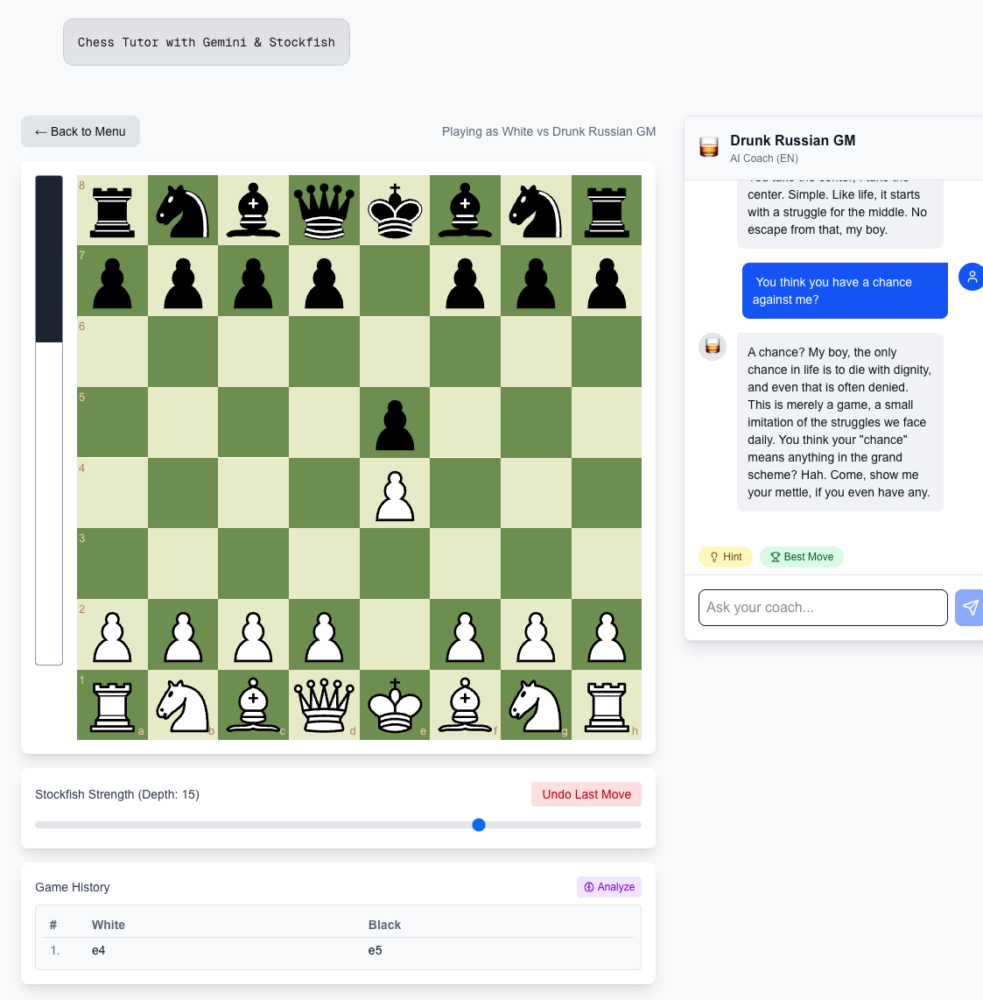
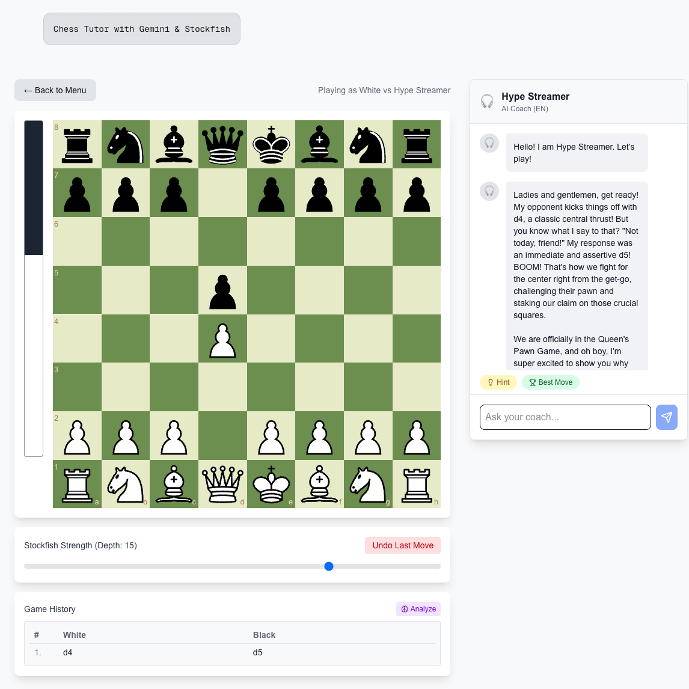
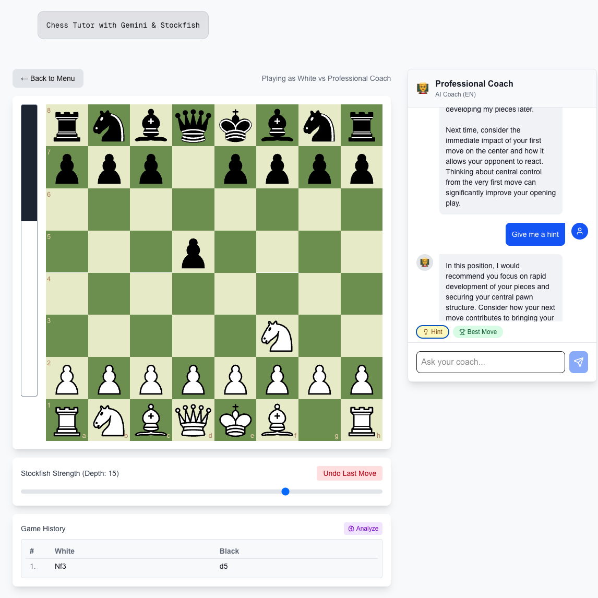
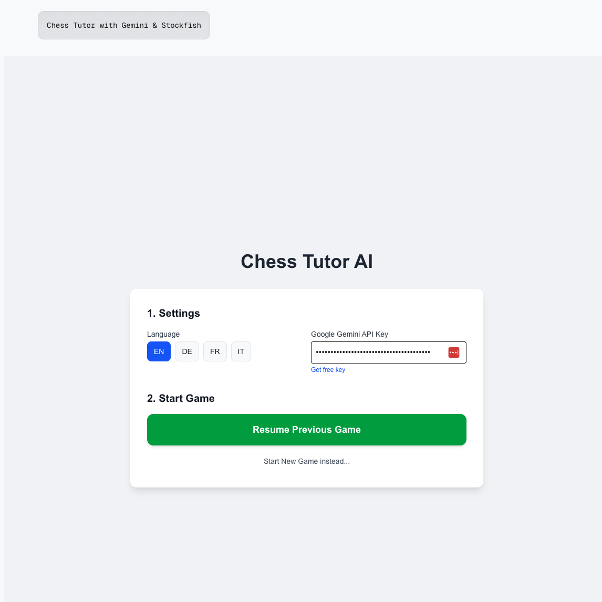

# AI Chess Tutor

## The Story
I always wanted to implement an AI-based chess tutor because I like playing chess, although to be honest, I actually suck at it. I didn't find the existing tutors or big apps useful enough for my needs, so I decided to build my own approach.

This application was built using **Antigravity by Google**. I like to work with it, though sometimes it just runs away. Still, I found the end result to be quite fun to play, which is why I'm sharing it here.

## How It Works

**AI Chess Tutor** is an interactive chess learning application where you play against an AI opponent powered by Stockfish while receiving real-time coaching feedback from a Large Language Model (LLM).

### Typical Game Flow

1. **Choose Your Personality**: Select from three unique AI coaching personalities, each with their own teaching style and character
2. **Play Chess**: Make your moves on the board while the Stockfish engine plays against you
3. **Get Real-Time Feedback**: After each move exchange, your AI tutor analyzes the position and provides personalized feedback based on:
   - Move quality and alternatives
   - Position evaluation changes
   - Opening theory (when applicable)
   - Tactical and strategic considerations
4. **Chat with Your Tutor**: Ask questions anytime using the integrated chat feature - your tutor will answer in character
5. **Post-Game Analysis**: When the game ends, review a comprehensive analysis showing your mistakes and learning opportunities


*Screenshot placeholder: Main game interface with board, evaluation bar, and chat*

## Features

### Core Features
- **Stockfish Engine**: Powerful chess engine for move analysis and opponent play
- **Opening Database**: Comprehensive database of chess openings with metadata and theory
- **Real-Time Evaluation**: Live position evaluation with visual evaluation bar
- **Move Analysis**: Detailed feedback on every move you make
- **Interactive Chat**: Ask your AI tutor questions and get personalized answers
- **Post-Game Analysis**: Review all your mistakes and missed opportunities after each game
- **Multi-Language Support**: Available in English, German, French, and Italian

### AI Personalities

Choose from three distinct coaching personalities, each offering a unique learning experience:

#### 🥃 Drunk Russian GM
*"Ach... life is pain, my boy"*

A bitter, fatalistic, but brilliant Grandmaster who has seen it all. Expect brutally honest feedback delivered with dark humor and existential commentary. This personality combines deep chess knowledge with a Dostoevsky-like atmosphere.


*Screenshot placeholder: Game with Drunk Russian GM personality*

#### 🎧 Hype Streamer
*"BRO! THAT MOVE WAS INSANE!"*

An energetic, loud, and entertaining chess streamer who makes every game exciting. Expect dramatic reactions, Gen-Z slang, and over-the-top commentary that keeps you engaged and motivated.


*Screenshot placeholder: Game with Hype Streamer personality*

#### 👨‍🏫 Professional Coach
*"Let's analyze the structure of this position"*

A strict, analytical, and straightforward chess coach focused on your improvement. Expect objective analysis, clear explanations based on chess principles, and professional teaching methods.


*Screenshot placeholder: Game with Professional Coach personality*

## Setup

### Prerequisites
- Node.js 18+ installed
- A free Google Gemini API key

### Getting Your Gemini API Key

1. Visit [Google AI Studio](https://aistudio.google.com/app/apikey)
2. Sign in with your Google account
3. Click "Create API Key"
4. Copy your API key

### API Key Configuration

You have two options for providing your Gemini API key:

#### Option 1: Browser Storage (Recommended for trying it out)
1. Run the application
2. When prompted, enter your API key in the modal dialog
3. The key will be stored in your browser's localStorage


*Screenshot placeholder: API key input modal*

#### Option 2: Environment Variable (Recommended for local development)
1. Create a `.env` file in the project root
2. Add your API key:
   ```
   NEXT_PUBLIC_GEMINI_API_KEY=your_api_key_here
   ```
3. The application will automatically use this key

> [!NOTE]
> You can update your API key anytime by clicking the key icon in the bottom-right corner of the application.

## Docker Deployment

### Quick Start with Docker

The easiest way to deploy Chess Tutor is using Docker Compose:

```bash
# Clone the repository
git clone https://github.com/your-username/chess_tutor.git
cd chess_tutor

# (Optional) Create .env file with your API key
echo "NEXT_PUBLIC_GEMINI_API_KEY=your_api_key_here" > .env

# Build and start the container
docker-compose up -d

# View logs
docker-compose logs -f
```

The application will be available at `http://localhost:3050`

### Environment Variables

You have two options for providing the Gemini API key:

1. **Environment Variable** (recommended for server deployment):
   - Create a `.env` file in the project root
   - Add: `NEXT_PUBLIC_GEMINI_API_KEY=your_api_key_here`
   - The application will automatically use this key

2. **Browser Storage** (fallback):
   - If no environment variable is set, users will be prompted to enter their API key
   - The key is stored in browser localStorage

> [!NOTE]
> The API key is never logged or exposed in application logs. It's only used for API calls to Google Gemini.

### Nginx Reverse Proxy

For production deployment behind nginx, use the provided `nginx.conf.example`:

```bash
# Copy the example configuration
sudo cp nginx.conf.example /etc/nginx/sites-available/chess-tutor

# Edit the configuration
sudo nano /etc/nginx/sites-available/chess-tutor
# Update: server_name, SSL certificates (if using HTTPS)

# Enable the site
sudo ln -s /etc/nginx/sites-available/chess-tutor /etc/nginx/sites-enabled/

# Test nginx configuration
sudo nginx -t

# Reload nginx
sudo systemctl reload nginx
```

### Manual Docker Build

If you prefer to build manually:

```bash
# Build the image
docker build -t chess-tutor:latest .

# Run the container
docker run -d \
  --name chess-tutor \
  -p 3050:3050 \
  -e NEXT_PUBLIC_GEMINI_API_KEY=your_api_key_here \
  --restart unless-stopped \
  chess-tutor:latest
```

  chess-tutor:latest
```

## Configuration

You can configure the application using environment variables in your `.env` file or Docker Compose configuration:

| Variable | Description | Default |
|----------|-------------|---------|
| `NEXT_PUBLIC_GEMINI_API_KEY` | Google Gemini API Key for AI features | (Required for AI) |
| `IMPRINT_URL` | External URL for the Imprint link in the footer. If not set, an internal page is used. | Internal Page |
| `DATA_PRIVACY_RESPONSIBLE_PERSON` | Name of the person responsible for data privacy (shown on /privacy page). | Placeholder |

## License

This project is licensed under the GNU General Public License v3.0 (GPLv3) - see the [LICENSE](LICENSE) file for details.

This application uses [Stockfish](https://stockfishchess.org/), which is licensed under the GPLv3.

## Credits
- Opening collection originally by [ragizaki/ChessOpeningsRecommender](https://github.com/ragizaki/ChessOpeningsRecommender)
- Chess engine: [Stockfish](https://stockfishchess.org/) (GPLv3)
- LLM: [Google Gemini](https://ai.google.dev/)

